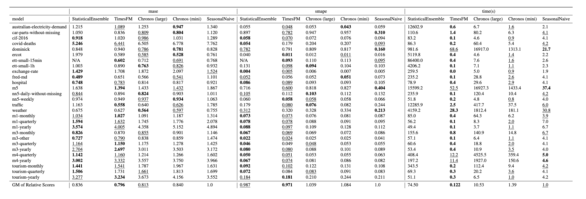

# Extended Benchmarks

The benchmark setting has been borrowed from Nixtla's original [benchmarking](https://github.com/AzulGarza/nixtla/tree/main/experiments/amazon-chronos) of time-series foundation models against a strong statistical ensemble. Later more datasets were added by the Chronos team in this [pull request](https://github.com/shchur/nixtla/tree/chronos-full-eval/experiments/amazon-chronos). We compare on all the datasets in this extended benchmarks.

All experiments were performed on a [g2-standard-32](https://cloud.google.com/compute/docs/gpus). 

## Running TimesFM on the benchmark

Install the environment and the package as detailed in the main README and then follow the steps from the base directory.

```
conda activate tfm_env
TF_CPP_MIN_LOG_LEVEL=2 XLA_PYTHON_CLIENT_PREALLOCATE=false python3 -m experiments.extended_benchmarks.run_timesfm --model_path=<model_path> --backend="gpu"
```

In the above, `<model_path>` should point to the checkpoint directory that can be downloaded from HuggingFace. 

Note: In the current version of TimesFM we focus on point forecasts and therefore the mase, smape have been calculated using the quantile head corresponding to the median i.e 0.5 quantile. We do offer 10 quantile heads but they have not been calibrated after pretraining. We recommend using them with caution or calibrate/conformalize them on a hold out for your applications. More to follow on later versions.

## Benchmark Results



We can see that TimesFM performs the best in terms of both mase and smape. More importantly it is much faster than the other methods, in particular it is more than 600x faster than StatisticalEnsemble and 80x faster than Chronos (Large).

Note: This benchmark only compares on `one` small horizon window for long horizon datasets like ETT hourly and 15 minutes. More in depth comparison on longer horizon rolling validation tasks are presented in our long horizon benchmarks.